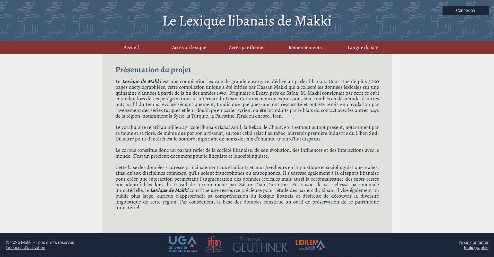

# Le Lexique Libanais de Makki

Le Lexique libanais de Makki, une compilation lexicale de grande ampleur, constitue un précieux témoignage du parler libanais avec un accent particulier sur la région du Sud du Liban. Cette dernière, étendue sur plus de 3000 pages dactylographiées, résulte du travail minutieux de l'ingénieur libanais Hassan Makki. Originaire d'Erkay, dans le sud-est de la ville de Saïda, Makki a consacré à partir de la fin des années 1990 près d'une quinzaine d'années à cette collecte linguistique.  

Pour valoriser ce précieux travail, nous avons développé une plateforme permettant de consulter cette ressource librement et pour tous. 

## Historique de la plateforme

| version | date |
|---------|----|
| 1.0     | février 2024| 
| 1.5     | février 2025| 

#### Changements effectués avec la version 1.5 : 
- <b>Refonte visuelle de l'interface</b> : changements de la charte graphique et de l'organisation de l'interface utilisateur
- <b>Nouvelles fonctionnalités</b> : ajout d'une rubrique "Connaissez-vous ce mot ?", traduction de l'interface en anglais, guide détaillé de l'utilisation de la plateforme côté administrateur
- <b>Gestion des fichiers de données</b> : mise à jour des scripts d'extraction de données et mise en forme dans un notebook pour une meilleure accessibilité, avec guide détaillée et tutoriels d'utilisation
- <b>Réorganisation de certaines caractéristiques</b> : affichage des thèmes, ajout d'un onglet "Remerciements", ajout d'une page "Bibliographie", suppression de la fonction "Télécharger" 
- <b>Corrections</b> : fonction recherche, corrections d'affichage mineures
- <b>Mise à jour de la documentation</b>

## Documentation

- [**Manuel d'utilisation : utilisateur**](guide.md)
- [Note de portabilité](port.md)
- [Note d'architecture](arch.md)
- [Note de sécurité](security.md)
